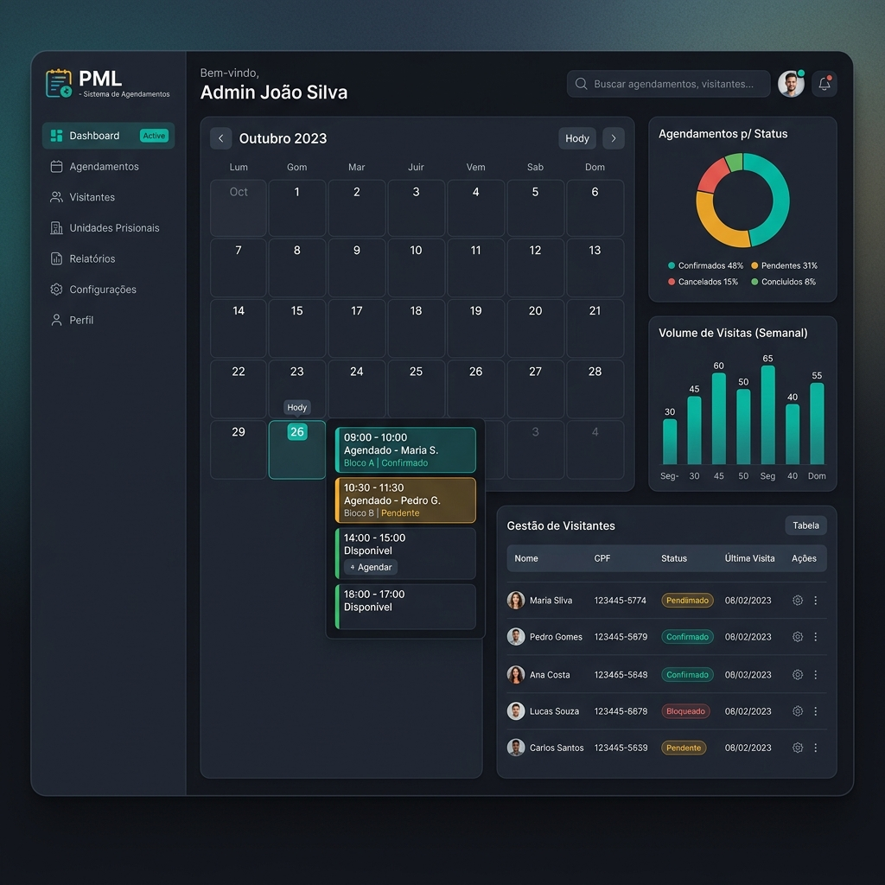

# PML - Sistema de Agendamentos e Gestão de Visitas



## 🏛️ Sobre o Projeto

O **Sistema de Agendamentos PML** foi desenvolvido para modernizar e otimizar os processos do setor social do **Presídio Masculino de Lages (PML)**. 

Idealizado e desenvolvido por **Eberson Carneiro** (Policial Penal e estudante de Ciência da Computação na Unifacvest), o projeto nasceu da necessidade de substituir um fluxo de trabalho manual e ineficiente que utilizava ferramentas limitadas (Wix e formulários genéricos) por uma plataforma robusta, segura e automatizada.

### 🚀 O Impacto em Números
*   **Agendamentos Mensais**: ~1.500 agendamentos realizados de forma 100% automatizada.
*   **Redução de Tempo (Carteirinhas)**: O processo de solicitação/renovação, que levava de **15 a 20 dias** via e-mail, agora é concluído em cerca de **10 minutos** dentro do sistema.
*   **Eficiência Administrativa**: Eliminação total do retrabalho de transcrição manual de dados para planilhas Excel.

---

## 🛠️ Tecnologias Utilizadas

Este projeto utiliza uma stack moderna para garantir performance, escalabilidade e segurança:

*   **Frontend**: [React.js](https://reactjs.org/) com [Vite](https://vitejs.dev/)
*   **Estilização**: [Tailwind CSS](https://tailwindcss.com/)
*   **Componentes UI**: [Radix UI](https://www.radix-ui.com/) & [Lucide React](https://lucide.dev/)
*   **Backend & Banco de Dados**: [Supabase](https://supabase.com/) (PostgreSQL + RLS Security)
*   **Autenticação**: Supabase Auth (JWT)
*   **Animações**: [Framer Motion](https://www.framer.com/motion/)
*   **Geração de Relatórios**: ExcelJS e bibliotecas para XLSX/CSV.

---

## ✨ Principais Funcionalidades

### 👥 Módulo do Visitante
- **Agendamento Inteligente**: Sistema de reserva de vagas com "Choice Eliminator" nativo, impedindo sobreposição de horários e excesso de vagas.
- **Gestão de Carteirinha**: Upload de documentos e acompanhamento de status de aprovação (Nova e Renovação).
- **Portal de Informações**: Canal de autoatendimento onde o visitante obtém informações cruciais sem necessidade de login.
- **Dashboard Pessoal**: Histórico de agendamentos e status de solicitações em tempo real.

### 🔐 Módulo Administrativo (Setor Social)
- **Painel de Controle**: Gestão centralizada de todos os agendamentos e usuários.
- **Aprovação de Documentos**: Fluxo simplificado para conferência e validação de carteirinhas.
- **Relatórios One-Click**: Geração instantânea de arquivos XLSX com métricas e dados filtrados por período.
- **Segurança i-Pen Ready**: O sistema complementa o sistema estadual i-Pen, preenchendo a lacuna de gestão de agendamentos e métricas de visitação.

---

## ⚙️ Como Rodar o Projeto

1.  **Clonar o repositório**:
    ```bash
    git clone https://github.com/Mudoviskyy/SiteAgendamentosPML.git
    ```

2.  **Instalar dependências**:
    ```bash
    npm install
    ```

3.  **Configurar variáveis de ambiente**:
    - Renomeie o arquivo `.env.example` para `.env.local`.
    - Adicione suas credenciais do Supabase.

4.  **Iniciar o servidor de desenvolvimento**:
    ```bash
    npm run dev
    ```

---

## 👨‍💻 Autor

**Eberson Carneiro**
- Policial Penal - SC
- Acadêmico de Ciência da Computação - Unifacvest

---
*Este projeto é uma iniciativa independente para a melhoria do serviço público e gestão prisional.*
